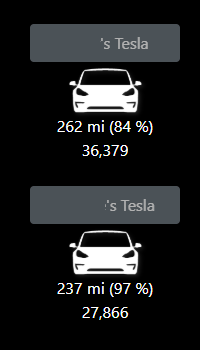

# tesla-dakboard-widget

[DAKBoard](https://dakboard.com) widget to hit Tesla API for your vehicles, loops through and presents the Name of the car, mileage, battery status (Estimated and %).



## Tech details

Uses [tesla-net](https://github.com/spboyer/tesla-net) library as a reference. Organization of this project is very beta.

Settings for your appsettings.Development.json file, suggest using secrets or ENV.

```json
  "TIMER_SETTING": "10000",
  "Tesla": {
    "TESLA_CLIENT_ID": "81527cff06843c8634fdc09e8ac0abefb46ac849f38fe1e431c2ef2106796384",
    "TESLA_CLIENT_SECRET": "c7257eb71a564034f9419ee651c7d0e5f7aa6bfbd18bafb5c5c033b093bb2fa3",
    "TESLA_LOGIN": "",
    "TESLA_PWD": ""
```

**ENVIRONMENT VARS**

`TIMER_SETTING` - milliseconds for how often to refresh the data. I am using 15-30 minutes.
`Tesla__TESLA_CLIENT_ID` - this might change, will update the readme
`Tesla__TESLA_CLIENT_SECRET` - this might change, will update the readme
`Tesla__TESLA_LOGIN` - your Tesla account login
`Telsa__TESLA_PWD` - your Tesla account password


